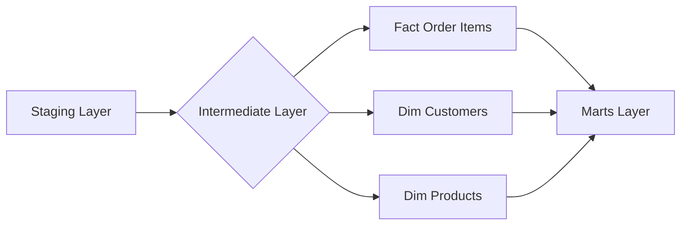

# 🏗️ Estrategia de la Capa Intermediate y Modelo Estrella

Este documento técnico describe la lógica de ingeniería y las decisiones arquitectónicas fundamentales para transformar los datos crudos de **Olist** en una estructura analítica optimizada y de alto rendimiento, utilizando **dbt** como nuestra herramienta principal. Esta capa es crucial para la preparación de datos antes de su consumo por herramientas de Business Intelligence (BI) y análisis avanzado.

## 1. El Porqué del Modelo Estrella (Star Schema)
En la fase de **Staging**, los datos están altamente normalizados (separados en múltiples tablas para evitar redundancia). Aunque esto es ideal para sistemas transaccionales, resulta ineficiente para el análisis de datos masivos.
Al pasar a un modelo estrella, buscamos optimizar las consultas y la usabilidad para los analistas de negocio.
### Flujo de Transformación

Hemos optado por una transición hacia un **Modelo Estrella** por las siguientes razones:
*   **Simplicidad para el Usuario Final:** Los analistas de negocio no necesitan conocer joins complejos entre 8 tablas; solo necesitan consultar una tabla de Hechos y sus Dimensiones.
*   **Rendimiento en Consultas:** Al reducir la cantidad de `JOINs` en tiempo de ejecución, las herramientas de BI (como PowerBI o Metabase) funcionan mucho más rápido.
*   **Consistencia de Métricas:** Centralizamos el cálculo de KPIs (como el `total_item_value`) en un solo lugar, evitando discrepancias entre diferentes reportes.

## 2. La Capa Intermediate: El "Motor de Unificación"
La capa Intermediate actúa como el puente crítico entre los datos técnicos y la visión de negocio. Su pieza central es el modelo `int_order_items_details`.

### ¿Cómo se construyó?
Se diseñó utilizando **CTEs (Common Table Expressions)** para mantener el código limpio y legible, siguiendo este flujo:
1.  **Granularidad Atómica:** Se tomó como base `stg_order_items`, asegurando que cada registro represente la unidad mínima de venta (el ítem).
2.  **Enriquecimiento Dimensional:** Se realizaron `LEFT JOINs` estratégicos con:
    *   `stg_orders`: Para obtener el estado de la orden y fechas de compra.
    *   `stg_customers`: Para vincular cada venta con el `customer_unique_id` (identidad real del cliente).
    *   `stg_products`: Para traer las categorías de productos ya normalizadas.

| Decisión | Justificación |
| :--- | :--- |
| **customer_unique_id** | Se priorizó sobre el ID temporal para permitir análisis de LTV y recurrencia real. |
| **total_item_value** | Cálculo centralizado de (Precio + Flete) para evitar discrepancias en reportes financieros. |
| **order_status** | Inclusión de filtros operativos para distinguir entre órdenes entregadas y canceladas. |

## 3. Estrategia de Materialización
Para optimizar el almacenamiento y la velocidad, hemos definido:

> [!TIP]
> **Vistas (Staging e Intermediate):** No ocupan espacio físico. Son transformaciones lógicas para asegurar frescura de datos.

> [!IMPORTANT]
> **Tablas (Marts):** Los modelos finales se materializan físicamente para garantizar que las consultas de BI sean instantáneas.

## 4. Garantía de Calidad (Data Testing)
La solidez de esta arquitectura está respaldada por una batería de **13 tests automáticos** que validan:
*   **Integridad Referencial:** Que cada ítem pertenezca a una orden y cliente existente.
*   **Unicidad:** Que no existan duplicados en las llaves primarias de las dimensiones.
*   **Calidad de Datos:** Verificación de `NOT NULL` en campos críticos de ingresos y fechas para asegurar la precisión de los promedios y tendencias.

---
**Preparado por:** Steven - Data Engineering Team
**Fecha:** Mayo 2026